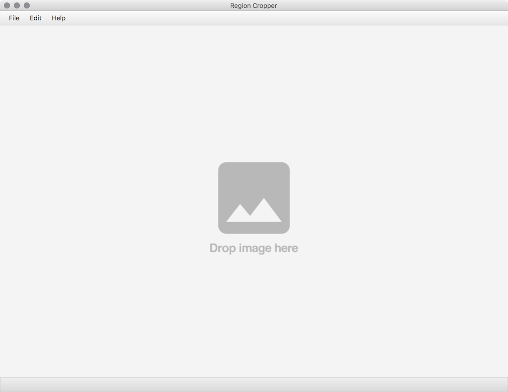

# Region Cropper

**This project is no longer maintained.**

Lately, I'm an effort to develop new tool that [mrdb-web-client](https://github.com/keiji/mrdb-web-client).
Please consider to use this.

## Requirements

 * Java > 1.8.0_40

## Download

 Binary(Zip): [https://github.com/keiji/region_cropper/releases](https://github.com/keiji/region_cropper/releases)

## 使い方（Usage）

    $ java -jar region_cropper_main.jar

### 処理する画像・ディレクトリを選択（Drop Images or Directories）

### 領域の追加（Add)

ドラッグ&ドロップで領域を設定します。選択中の領域は黄色の枠で表示されます。

### 領域の選択（Select)

現在選択中の領域は赤枠で示されます。

スペース（Space）キーを押すと、選択中の領域がハイライトされます。

また、Shift + スペースでハイライト状態でロックできます。もう一度スペースを押すと、ロックを解除します。

| キー | 動作 |
|:-----------|:------------|
| Enter | 次の領域へ移動。最後の領域であれば次のファイルを表示 |
| Shift + Enter | 前の領域へ移動。最初の領域であれば前のファイルを表示 |
| Tab | 次の領域へ移動 |
| Shift + Tab | 前の領域へ移動 |
| End | 次のファイルを表示 |
| Home | 前のファイルを表示 |

### 領域の編集（Edit）

| キー | 動作 |
|:-----------|:------------|
| 方向(←↑→↓) | 領域を移動 |
| Alt または Option + 方向(←↑→↓) | 領域を「拡大（Expand）」 |
| Windows または Command + 方向(←↑→↓) | 領域を「縮小（Shrink）」 |
| 削除（Delete） | 領域を「削除（Delete）」 |
| Ctrl + z | 元に戻す（Undo） |

Shift を押すと、変化量が小さくなり微調整できます。

### ラベルの設定（Label）

数字キーの「0〜9」を押すと、選択した領域にラベルを設定します。
追加した領域のラベルは、標準で 1 が設定されています。

また、ラベル 0 は負例として特別な意味を持ちます。
負例に設定した領域は、編集や削除ができません。

### 領域の切り出し（Crop）

領域の切り出しには「Quick crop」と「Crop to...」の２つの方法があります。

「Quick crop」を選択すると、設定している領域を、処理中の画像と同じディレクトリに切り出します。
出力先のディレクトリを設定したい場合は「Crop to...」を選択します。

    [出力先のディレクトリ]/label-[ラベル]/[画像名]-[領域番号].png

----

## License

    Copyright 2016 Keiji ARIYAMA

    Licensed under the Apache License, Version 2.0 (the "License");
    you may not use this file except in compliance with the License.
    You may obtain a copy of the License at

       http://www.apache.org/licenses/LICENSE-2.0

    Unless required by applicable law or agreed to in writing, software
    distributed under the License is distributed on an "AS IS" BASIS,
    WITHOUT WARRANTIES OR CONDITIONS OF ANY KIND, either express or implied.
    See the License for the specific language governing permissions and
    limitations under the License.
